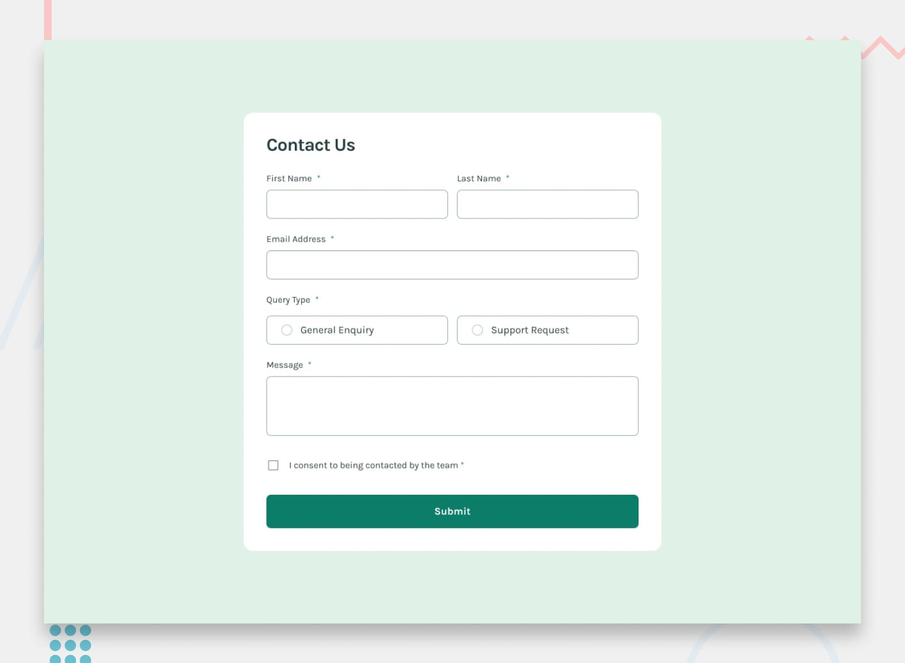

# Frontend Mentor - Contact form



## Welcome! 👋

Thanks for checking out this front-end coding challenge.

[Frontend Mentor](https://www.frontendmentor.io) challenges help you improve your coding skills by building realistic projects.

**To do this challenge, you need a good understanding of HTML, CSS and JavaScript.**

## The challenge

Your challenge is to build out this contact form and get it looking as close to the design as possible. Pay particular attention to making this form accessible. Building accessible forms is a key skill for front-end developers. So this is a perfect challenge to practice.

You can use any tools you like to help you complete the challenge. So if you've got something you'd like to practice, feel free to give it a go.

Your users should be able to: 

- Complete the form and see a success toast message upon successful submission
- Receive form validation messages if:
  - A required field has been missed
  - The email address is not formatted correctly
- Complete the form only using their keyboard
- Have inputs, error messages, and the success message announced on their screen reader
- View the optimal layout for the interface depending on their device's screen size
- See hover and focus states for all interactive elements on the page

Want some support on the challenge? [Join our community](https://www.frontendmentor.io/community) and ask questions in the **#help** channel.

### Screenshot


### Links

- Solution URL: [Add solution URL here](https://your-solution-url.com)
- Live Site URL: [Add live site URL here](https://your-live-site-url.com)

## My process

I'm actually learning Vue so there's no particular process.
I always start with the layout which isn't finished yet, then I add the features and I finish with some effects/animations/transitions.

### Built with

- Mobile-first workflow
- [Vue.JS](https://vuejs.org) - JS library
- [Tailwindcss](https://tailwindcss.com/) - For styles


### What I learned

I learned conditional rendering with 'v-if' which I still do not fully understand. </br>
And it was a good exercise to practice logical thinking.


### Continued development

- I'm still figuring out the best way to unchecked the radio input. </br>
- I have to prevent the form to be sent if required fields are empty. </br>
- Display an error message if a required field is empy. </br>
- Add transitions between each steps
- Make the notification stay on screen

[//]: # (See example below or full code in the project :)

[//]: # (```js)

[//]: # (const day = now.getDay&#40;&#41; ; // returns a number representing the day of the week, starting with 0 for Sunday)

[//]: # (```)

[//]: # (```html)

[//]: # (<p><span>{{ actualDay }}</span>days</p>)

[//]: # (```)

[//]: # (### Useful resources)

[//]: # ()
[//]: # (- [SheCodes]&#40;https://www.shecodes.io/athena/13276-how-to-get-current-day-and-time-in-javascript#:~:text=To%20get%20the%20current%20day%20and%20time%20in%20JavaScript%2C%20you,the%20built%2Din%20Date%20object.&text=const%20now%20%3D%20new%20Date&#40;&#41;%3B,getHours&#40;&#41;%3B%20const%20minutes%20%3D%20now.&#41; - This helped me to get current date object to make logical function)

## Author

- Website - [Sola Kabuta](https://solakabuta.com/)
- Frontend Mentor - [@SolaKabuta](https://www.frontendmentor.io/profile/SolaKabuta)

